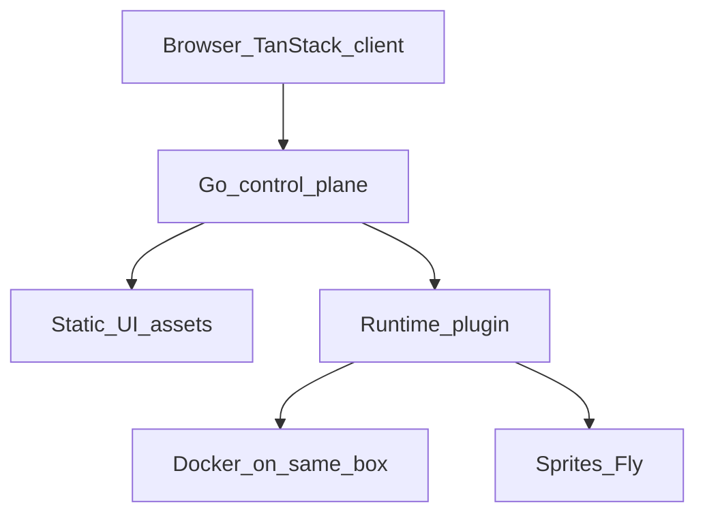

# Farplane

## Scope

This plan covers the server design, the client UI shape, and the fast verify toolchain.

The product has four parts:

1. The Go control plane
2. The TanStack client UI
3. The compute plane
4. The verify toolchain for agents and CI

## App stack

### Go control plane

The control plane is a Go program. Install it on a small host that stays on.

Go owns all backend work:

- User auth with Google or email invite
- Org and membership records in Postgres
- Project records in Postgres
- Lane records, chat history, and share rules in Postgres
- Preview URL routing
- API and real-time streams to the browser
- Runtime plugin calls for Lane computers

Go also serves the built TanStack static files from the same binary or the same process when that keeps deploy simple.

### Postgres

The Go control plane reads and writes Postgres as the source of truth for control-plane data.

Store in Postgres:

- Users and auth links
- Orgs and membership
- Projects
- Lanes, chat history, and share rules
- Runtime IDs and Lane status metadata

Use a Postgres connection string in config (for example `DATABASE_URL`). Run schema migrations from the Go service. Local install can run Postgres in Docker next to the control plane.

### TanStack client UI

The UI is a client-only React SPA built with **TanStack Router** (not TanStack Start).

Docs: [TanStack Router overview](https://tanstack.com/router/latest/docs/overview), [CLI reference](https://tanstack.com/cli/latest/docs/cli-reference), [Router + Rspack/Rsbuild](https://tanstack.com/router/latest/docs/installation/with-rspack).

Rules:

- Use TanStack Router for routing, loaders, search params, and file-based routes.
- Use TanStack Query for client data caches against the Go API.
- Use **Rsbuild** (Rspack) as the bundler.
- Keep the app client-only. Go owns auth, data, and streams.

#### CLI create command

Use `--router-only` so the CLI makes a Router SPA, not TanStack Start.

```bash
bunx @tanstack/cli create web \
  --router-only \
  --framework React \
  --package-manager bun \
  --no-examples \
  -y
```

Notes from the CLI:

- Default `tanstack create` makes a **Start** app with SSR.
- `--router-only` makes a file-based Router-only app and turns off Start.
- With `--router-only`, CLI add-ons, deployment adapters, and templates are disabled.
- `--toolchain` only offers lint toolchains such as `eslint` or `biome`. It does **not** offer Rsbuild.
- First-class Rsbuild support in TanStack blog/docs is for **Start**. For Router-only + Rsbuild, wire Rsbuild by hand after create (or scaffold Rsbuild first, then add Router).

#### Rsbuild after create

Router supports Rsbuild/Rspack through `@tanstack/router-plugin/rspack`.

1. Add `@rsbuild/core`, `@rsbuild/plugin-react`, and `@tanstack/router-plugin`.
2. Replace Vite scripts with `rsbuild dev` / `rsbuild build`.
3. Use an `rsbuild.config.ts` like this:

```ts
import { defineConfig } from '@rsbuild/core'
import { pluginReact } from '@rsbuild/plugin-react'
import { tanstackRouter } from '@tanstack/router-plugin/rspack'

export default defineConfig({
  plugins: [pluginReact()],
  tools: {
    rspack: {
      plugins: [
        tanstackRouter({
          target: 'react',
          autoCodeSplitting: true,
        }),
      ],
    },
  },
})
```

4. Add TanStack Query by hand (`bun add @tanstack/react-query`), because `--router-only` disables CLI add-ons.

Reason:

- Go keeps latency low.
- Go keeps memory use low.
- One backend owns performance and deploy size.
- TanStack Router fits client-side caches and typesafe navigation.
- Rsbuild/Rspack fits a fast native bundler path for agents and CI.

### What the TanStack client needs

The client build needs a JS toolchain. It does not need a JS server at runtime.

Use:

| Tool | Role |
|---|---|
| **Bun** (pinned via mise) | Package manager and script runner |
| **Rsbuild** (+ Rspack) | Bundler for the SPA |
| **React** | UI library |
| **TanStack Router** | Client routing, loaders, search params |
| **TanStack Query** | Client data fetching against the Go API |
| **`@tanstack/router-plugin`** | File-based route generation via the Rspack plugin |

Production still serves the built static files from Go. Bun and Rsbuild are build-time tools on developer machines and in CI.

### Compute plane

The compute plane runs each Lane computer. Each Lane has one isolated computer. That computer can sleep. That computer can wake.

Only trusted users can log in. One install serves one company or one friend group.



## Tooling with mise

Use a root `mise.toml` to pin project tools.

Example shape:

```toml
[tools]
go = "1.24"
bun = "1.2"
golangci-lint = "2"

[tasks.verify]
run = "..."
```

Pin Go and Bun to stable versions when the repo starts. Add a short README note: install [mise](https://mise.jdx.dev/), run `mise install`, then build and verify.

Typical commands after `mise install`:

- `go` for the control plane
- `bun install` in the UI package
- `bun run dev` / `rsbuild dev` for the client in development
- `bun run build` / `rsbuild build` to emit static assets that Go serves
- `mise run verify` for the fast PR checks

## Verify toolchain

Goal: agents and CI get feedback in seconds. Prefer native Rust and Go tools.

### Client verify tools

| Job | Tool |
|---|---|
| Format | **Oxfmt** |
| Lint | **Oxlint** |
| Types | **TypeScript 7** (`tsgo`) |
| Unit tests | **Vitest** |

### Go verify tools

| Job | Tool |
|---|---|
| Format | **golangci-lint fmt** / **gofumpt** |
| Lint | **golangci-lint** v2 |
| Vulns | **govulncheck** |
| Unit tests | **`go test ./... -short`** |

### PR and agent loop

Run these on every PR and in the local agent loop:

1. `oxfmt --check`
2. `oxlint`
3. `tsgo --noEmit`
4. `vitest run` for unit tests
5. `golangci-lint fmt --diff`
6. `golangci-lint run`
7. `go test ./... -short`

Expose one command, for example `mise run verify`, so agents always call the same path.

### Post-merge gate

Run these after merge or on the deploy path:

- Lane integration tests against Docker or Sprites
- End-to-end UI tests against a real preview URL
- Heavier Go checks such as `go test -race` when needed

Keep the PR loop fast. Keep the slow truth checks after merge.

## Product words

| Word | Meaning |
|---|---|
| **Org** | One company or friend group on one install |
| **Project** | One app repo, for example a Rails app |
| **Lane** | One unit of work on a Project |

A Lane is a parallel path of work on a Project.

A Lane includes:

- Chat with the agent
- One isolated computer
- Setup for the Project
- A preview URL for the running app
- Share rules

Example speech:

1. Open a Lane on the Rails Project.
2. The agent sets up the Project on Docker or Sprites.
3. The user asks for a feature. The agent builds it.
4. The user shares the Lane preview URL so others can test.

### Share modes for a Lane

Default:

- Private. Only the owner can see it.

Also allow:

- Shared with named people in the Org
- Open to the full Org

The preview URL follows the same share rules.

## Runtime plugins

Use a Runtime plugin interface in Go. Select the plugin in config.

### Docker plugin

Use Docker as the default plugin for local install.

Facts:

- Users know Docker.
- Install the Go binary and Docker on one host.
- Each Lane runs as a container on that host.
- This path fits small teams.
- Host size limits how many Lanes you can run.

### Sprites plugin

Use Sprites as the cloud plugin for elastic compute.

Facts:

- Sprites gives each Lane a persistent computer.
- The computer can sleep when idle.
- The computer can wake on a new request.
- The disk stays across sleep.
- Preview services can start again after a cold wake.
- This path fits work that lasts many days.

## Install stories for the README

Write these three stories:

1. Local install: set `RUNTIME=docker`. Use one host, Docker, and Postgres. Run Lane computers as local containers. Serve the TanStack client from Go.
2. Cloud install: set `RUNTIME=sprites`. Keep the control plane small with Postgres. Let Sprites sleep and wake the Lane computers. Serve the TanStack client from Go.
3. Same binary: use one Go binary for both stories. Change only the config, `DATABASE_URL`, and the runtime API credentials.

## Build order for v1

Do this work in order:

1. Add `mise.toml` with Go, Bun, and verify tool pins.
2. Define the Postgres schema and Go migrations.
3. Define the Runtime interface in Go. Include Create, Exec, Destroy, PreviewURL, and InjectSecrets.
4. Implement the Docker adapter first. Prove that a user can self-host with no cloud vendor.
5. Implement the Sprites adapter second. Prove sleep, wake, durable disk, and shareable previews.
6. Define one Lane image for both adapters. Include git, mise, skills setup, and a default preview port.
7. Store Lane share modes in Postgres: private, named people, or full Org.
8. Scaffold TanStack Router with `--router-only`, switch to Rsbuild + `@tanstack/router-plugin/rspack`, add Query by hand, then wire the SPA to the Go API.
9. Wire `mise run verify` with oxlint, oxfmt, TypeScript 7, Vitest, golangci-lint, and `go test -short`.
10. Put Lane integration and E2E tests on the post-merge gate.

## Control plane duties

The Go control plane must:

- Connect to Postgres with `DATABASE_URL`
- Run schema migrations
- Store auth and org membership in Postgres
- Store Project records in Postgres
- Map each `lane_id` to a `runtime_id` in Postgres
- Store Lane share rules and enforce them
- Stream agent sessions into the runtime and out to the browser
- Map preview host names and apply auth when needed
- Inject secrets at create time and at wake time
- Store runtime IDs and status in Postgres
- Serve the TanStack static client
- Let the vendor own idle and wake policy when possible

## Where compute and data live

- Lane compute runs in the selected Runtime plugin.
- Production-like database clones for a Lane live in the Lane computer in a later phase.
- The control plane uses Postgres for Org, Project, Lane, share, and routing metadata.
- The browser holds only client UI state. Source of truth for control-plane data stays in Postgres through Go.
